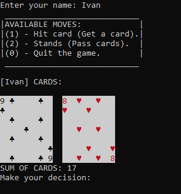
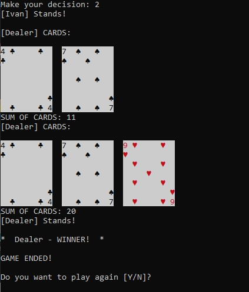

# Game 21

### Brief description of the game
The game is played by a person against a computer (the so-called dealer).\
The goal of the game is to score a total of 21 points.\
Play with one deck of 52 cards.

### Points calculation
Jack - 2 points\
Lady - 3 points\
King - 4 points\
Ace - 11 points\
The rest of the cards are valued at face value when calculating points.

## Getting started
Since the game supports visual display of cards, you need to prepare the environment and install the [necessary libraries](https://github.com/pwildenhain/terminal_playing_cards).\
⬇️ Install the package from PyPI.
```
pip install terminal_playing_cards
```
⬇️ Download a copy of program.
```
git clone https://github.com/Chepa14/Game_21.git
```
📝Open the directory with game
```
cd <path-to-directory>\Game_21
```
🙇‍♂️And finally run the game
```
python main.py
```
## Some Screenshots
\
\

